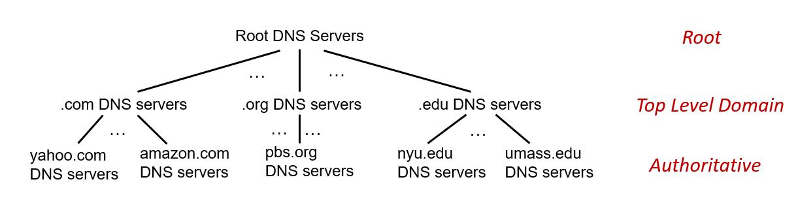

# Chapter 2 - Application Layer

- [Principles of Network Applications](#principles-of-network-applications)
- [Web and HTTP](#web-and-http)
- [E-Mail SMTP and IMAP](#-e-mail-smtp-and-imap)
- [Domain Name System](#domain-name-system)
- [P2P Applications](#p2p-applications)
- [Video Streaming and Content Distribution Networks](#video-streaming-and-content-distribution-networks)
- [Socket Programming](#socket-programming)

## Questions
How do applications with P2P architectures have client and server processes (Ch2 slide 8)
Explain how persistent HTTP works
How to solve for perforamnce on slide 46
Slide 59 SMTP interaction
Is DNS kinda just like a big lookup table?
DNS name resolution recursive query go over 
What if no one in torrent has file?

## Principles of Network Applications
- No need to write software for network-core devices (routers, switches, gateways, etc.)
    - They do not run on user-applications
    - Applications on end systems allows for rapid app development and propagation

**Client-server Paradigm**
- Clients:
    - Contact and communicate with the server
    - May be intermittently connected
    - May have dynamic IP addresses
    - Do not communicate directly with each other
    - Ex. HTTP, IMAP, FTP
- Server:
    - Always-on host
    - Permanent IP address
    - Often in data centers for scaling

**Peer-Peer Architecture**
- No always-on server
- Arbitrary end systems directly communicate
- Peers request servi e from other peers who provide service in return to other peers
    - New peers bring new servoce capacity as well as new service demands (self scaling)
- Peers are intermittently connected and change IP addresses
    - complex management

Pretty much everyone is connected to each other or everyone connects to a server

**Process Communicating**
- A process is a program running within a host
- Within the same host, two processes communicate using inter-process communication (as defined by OS)
- Processes in different hosts communicate by exchanging messages
- **Client process**: initiates communication
- **Server process**: waits to be contacted

Note: applications with P2P architectures have client and server processes

Sockets
---
- Process sends/recieves messages to/from its socket
- Socket analogous to door
    - Sending process shoves message out door
    - Sending process relies on transport infrastructure on other side of door to deliver message to socket at receiving process
    - Two sockets involved: one on each side

**Addressing Processes**
- Processes must have an identifier to receive messages
- Host has a unique 32-bit IP address
    - IP address of host on which process runs cannot be used for ID as many processes run on the same host
- The identifier includes both IP address and port numbers associated with process on host
    - Example port numbers are 80 (HTTP) and 25 (SMTP)

The application-layer protocol defines:
- Types of messages exchanged (request, response, etc.)
- Message syntax (how fields are structured and delineated)
- Message semantics (meaning of information in fielsd)
- Rules for when and how processes send and respond to messages
- Open protocols
    - Defined in RFCs (everyone has access to protocol definition)
    - Allows for easy exchange of info
- Proprietary protocols (skype, zoom, etc.)

Transport Service needed by App:
- Data integrity:
    - Some apps require 100% reliable data transfer (file transfer, web transactions, bank shit, etc.)
    - Other apps can tolerate some loss (audio, video, etc.)
- Timing:
    - Some apps require low delay to be "effective" (internet, telephony, interactive games, etc.)
- Throughput:
    - Some apps require minimum amount of throughbut to be "effective" (multimedia)
    - Other apps make use of whatever they got ("elastic apps")
- Security:
    - Encryption, data integrity, etc.

Internet Transport Protocol Services
---
**TCP Service**
- Reliable transport between sending and receiving process
- Flow control: sender won't overwhelm reciever
- Congestion control: throttle sender when network overloaded
- Connection-oriented: setup required between client and server processes
- Does not provide: timing, minimum throughput guarantee, security

**UDP Service**
- Unreliable data transfer between sending and receiving process
- Does not provide: reliability, flow control, congestion control, timing, throughput guarantee, security, or connection setup (wtf)
- UDP doesn't need to establish a connection or send acknowledgements, resulting in faster data transmission compared to TCP

Note: Use Transport Layer Security (TLS) to secure TCP
- Provides encrypted TCP connections, data integrity, and end-point authentication

## Web and HTTP
- Web page consists of objects, each of which can be stored on different Web servers
- Web page consists of base HTML-file which has several referenced objects, each addressable by a url
    - Ex. www.school.edu (host name) /some_dept/pic.gif (path name)

**HTTP Overview** (Hypertext transfer protocol)
- Web's application-layer protocol
- Client/server model
    - Client: browser that requests, recieves, and "displays" web objects
    - Server: Web server sends objects in response to requests
- HTTP uses TCP
    1. Client initiates TCP connection (creates socket) to server on port 80
    2. Server accepts TCP connection from client
    3. HTTP messages exchanged between browser (HTTP client) and web server (HTTP server)
    4. TCP connection closed
- HTTP is "stateless" as the server maintains no information about past client requests
    - Protocols that maintain "state" are complex as past state must be maintained and if it crashes the views may be inconsistent

Two Types of HTTP connections:
- Non-persistent HTTP
    1. TCP connection opened
    2. At most one object sent over TCP connection
    3. TCP connection closed
- Persistent HTTP
    1. TCP connection opened to a server
    2. Multiple objects an be sent over *single* TCP connection between client and that server
    3. TCP connection closed

**Round Time Trip (RTT)** = time for a small packet to travel from client to server and back
**HTTP Response Time** (per object)
- One RTT to initiate TCP connection
- One RTT for HTTP request and first few bytes of HTTP response to return
- Object/file transmission time

**HTTP Connection RTT**
- Non-persistent: 2RTT + File Transmission Time
    - Requires 2 RTTs per object
    - OS overhead for each TCP connection
    - Browsers often open multiple parallel TCP connections to fetch referenced objects in parallel
- Persistent:
    - Server leaves connection open after sending response
    - Subsequent HTTP messages between same client/server sent over open connection
    - Client sends requests as soon as it encounters a referenced object
    - As little as one RTT for all the referenced objects (cutting response time in half)

**HTTP Request** Messages:
- Includes request line (type, ex. `GET`, `POST`, `HEAD`) and header lines, then body
- In ASCII characters

- `POST` method
    - web page could sometimes include input
    - User input sent from client to server in body of `POST` request message
- `GET` method
    - Get data from server
- `HEAD` method
    - Requests headesr (only) that would be returned if specified URL were requested with an HTTP `GET` method
- `PUT` method
    - Uploads new file (object) to server
    - Completely replaces file that exists at specified URL with content in entity body of `POST` HTTP request message

Cookies
---
- HTTP `GET`/Resonse interaction is stateless
- There is no notion of multi-step exchanges of HTTP messages to ocmplete a web "transaction"
    - No need for client/server to track "state" of multi-step exchange
    - All HTTP requests are independent of each other
    - No need for client/server to "recover" from a partially completed by never completely completed transaction
- Sites and client browser use cookies to maintain some state between transactions
- Can be used for: authorization, shopping carts, recommendations, usr session state
    - Keep state at protocol endpoints (maintain state at sender/receiver over multiple transactions)
    - Also keep state in HTTP messages
- A "first-party" cookie allows site to remember preferences, login details, settings, etc.
    - Track user behavior on a given website
- A "third-party" cookie comes from site that you did not choose to visit
    - Track user behavior across multiple websites (without even visiting tracker site!)

**Four components to cookies**
1. Cookie header line of HTTP response message
2. Cookie header line in next HTTP request message
3. Cookie file kept on user's host managed by user's browser
4. Back-end database at web site

Web Caches
---
- Use to satisfy client requests without involving origin server 
- User configures browser to point to a (local) web cache
- Browser sends all HTTP requests to cache
    - If object in cache: return object to client
    - Else: cache requests object from origin server, caches received object, then returns object to client

- Acts as both a client and a server (client to origin server, server to original user)
- Server tells cache about object's allowable caching in response header (`Cache-Control` field in header)
- Use to reduce response time for client request (cache is closer to client)
- Reduces traffic on an institution's access link
- Use when internet is dense with caches (enables "poor" content providers to deliver content more effectively)

- Access link utilization is: avg. data rate to browsers / access link rate
    - Remember high utilization (close to 1) = large queueing delays
- If a cache rate has a hit rate of 0.4:
    - 40% of requests served by cache with low delay (msec)
    - 60% of requests satisfied by origin

**Conditional GET with Browser Caching**
- Goal: don't send object if browser has up-to-date cached version
    - No object transmission delay (or use of network resources)
- Client: specify date of browser-cached copy in HTTP request
- Server: response contains no object if browser-cached copy is not up-to-date

HTTP2
---
Key goal: Decreased delay in multi-object HTTP requests

HTTP1.1: introduced multiple pipelined GETs over single TCP connection
- Server responds in-order (first come first served) to GET requests
- With this, a small object might have to wait for transmission behind large objects (HOL blocking (head of line))
- Loss recovery (retransmitting lost TCP segments) stalls object transmission

HTTP2: Increased flexibility at server in sending objects to client
- Methods, status codes, most header fields unchanged from HTTP 1.1
- Transmission order of requested objects based on client-specified object priority
- Push unrequested objects to client
- Divide objects into frames, schedule frames to mitigate HOL blocking

HTTP2 over TCP means:
- Recovery from packet loss still stalls all object transmissions
- No security over vanilla TCP connection

HTTP3: Adds security, per object error and congestion control (more pipelining) over UDP
- More on this in transport layer

## E-Mail SMTP and IMAP
**Email**
- Three major components: user agents, mail servers, and the simple mail transfer protocol (SMTP)

**User Agent**
- Compoing, editing, reading mail messages
- Outgoing and incoming messages stored on server

**Mail Servers**
- Mailbox contains incoming messages for user
- Message queue of outgoing (to be sent) mail messages

**SMTP Protocol**
- Between mail servers to send email messages
- Client: sending mail server
- Server: receiving mail server

**SMTP RFC (5321)**
- Uses TCP to reliably transfer email message from client to server, port 25
    - Mail server initiating connection
    - Direct transfer: sending server (acting like client) to receiving server
- Three phases of transfer:
    1. Handshaking
    2. Transfer of messages
    3. Closure
- Command & response interaction (like HTTP)
    - Commands: ASCII text
    - Response: Status code and phrase

Comparison with HTTP:
- Both have ASCII command/response interaction & status code
- HTTP:
    - Client pull
    - Each object encapsulated in its own response message
- SMTP:
    - Client push
    - Multiple objects sent in multipart message
    - Uses persistent connections
    - Requires message (header & body) to be in 7-bit ASCII
    - Server uses CRLF to determine end of message

Mail message format for SMTP defined in RFC 5321
Syntax for e-mail message itself defined in RFC 2822 (Header Lines & Body)

Mail Access Protocols
---
- SMTP = Delivery/storage of e-mail messages to receiver's server
- IMAP = Provides retrieval, deletion, folders of stored messages on server
- HTTP = Provides web-based interface on top of SMTP (to send) and IMAP (to retrieve) 

## Domain Name System
- A method to map between IP address and a name and vice versa
- A *distributed database* implemented in hierarchy of many name servers
- DNS servers communicate to resolve names (addres/name translation)
    - Core internet function implemented as application-layer protocol

**DNS Services**:
- Hostname to IP address translation
- Host & mail server aliasing (canonical, alias names)
- Load distribution: Many IP addresses correspond to one name

Do not centralize DNS due to:
- It having a single point fo failure
- A HEAVY of traffic volume
- Distant centralized database
- Crazy amount of maintenence
- Would not scale to our growing needs

- Ex. say someone wants IP address for `www.amazon.com`
    - Client queries root server to find `.com` DNS server
    - Client queries `.com` DNS server to get `amazon.com` DNS server
    - Client queries `amazon.com` DNS server to get IP address for `www.amazon.com`

**Root Name Servers**
- Internet couldn't function without it
- DNSSEC provides security (authentication, message integrity)
- ICANN (Internet Corporation for Assigned Names and Numbers) manages root DNS domain

**Top-Level Domain (TLD) servers**: 
- Responsible for all popular domains (.com, .net, .org, etc.) and all top-level country domains
- DNS Registrars:
    - Network solutions: authoritative registry for .com, .net TLD
    - Educause: .edu TLD

**Authoritative DNS Servers**:
- Organization's own DNS server(s) providing authoritative hostname to IP mappings for organization's named hosts
- Can be maintained by organization or service provider

**Local DNS Name Servers**
- When host makes DNS query, it is sent to its *local* DNS server
    - Local DNS server returns reply answering: recent name-to-address translation pairs and forwarding request into DNS hierarchy for resolution
    - Each ISP has local DNS name server
- Local DNS server doesn't strictly belong to hierarchy

**DNS Name Resolution**
- Iterated query: contacted server replies with name of server to contact
    - "I don't know the name but ask this server"
- Recursive query: puts burden of name resolution on contacted name server
    - Heavy load at upper levels of hiearchy

**Caching DNS Information**
- Once any name server leans a mapping, it caches it and immediately returns a cached mapping in response to query
    - Caching improves response time
    - Cache entries timeout (disappear) after some time (time to live (TTL))
    - TLD servers typically cahced in local name servers
- Cached entries may be out-of-date
    - If named host changes IP address may not know until TTL expires

**Types of DNS Records**

DNS: Distributed database storing resource records (RR) 
- RR format: (`name`, `value`, `type`, `ttl`)

- Type = A
    - `name` = hostname
    - `value` = IP address
- Type = NS
    - `name` = domain (ex. aidan.com)
    - `value` = hostname of authoritative name server for this domain
- Type = CNAME
    - `name` = alias name for some "canonical" (real) name
    - Ex. `www.ibm.com` = `servereast.backup2.ibm.com`
    - `value` = Canonical name
- Type = MX
    - `value` = Name of SMTP mail server associated with `name`

- DNS query and reply messages both have the same format
    - Header has 16 bit ID and flags
    - Name and & type fields for a query in questions
    - RRs in response to query in answers
    - Records for authoritative servers in authority
    - Additional "helpful" info that may be used in additional info

**How to Get into the DNS**
- Ex. new startup "Aidan"
- Register name aidan.com at DNS registrar (ex. Network Solutions)
    - Provide names, IP addresses of authoritative name server (primary and secondary)
    - Registrar inserts NS, A RRs into .com TLD server
- Create an authoritative server locally with the IP address you want

**Security**
- DDoS attacks: bombard root servers with traffic
    - Local DNS servers cache IPs of TLD servers allowing root server bypass
    - There's traffic filtering in these servers
- Spoofing Attacks: intercept DNS queries, returning bogus replies

## P2P Applications
**Peer to Peer Architecture**
- No always-on server
- End systems directly communicate with each other
- Peers sequest service from other peers, providing service in return to other peers
- Peers are intermittently connected and change IP addresses

**Comparing Client to Server with P2P**
Time to distribute file (size F) from one server to N peers
- Peer upload/download capacity is a limited resource
- Server transmission: must send (upload) N file copies
    - Time to send N copies: N * F / t(s)
    - In P2P it is: F / t(s)
- Client: each client must download the copy
    - Min client download time: F / d(min)
    - In P2P it is: F / d(min)

- For P2P, clients as aggregate must download NF bits
    - Max upload rate is t(s) + sum(t)

Total times to distribute F to N clients:
- Client-Server approach: max(NF/t(s), F/d(min))
- P2P approach: max(F/t(s), F/d(min), NF/(t(s) + sum(t)))

- Client-Server increases linearly with N
- P2P also increases linearly with N but each peer brings service capacity

In general, they both "seem" linear but P2P adds more service as it grows, thus looking more logarithmic than the linear client-server.

**BitTorrent**
- P2P file exchanging platform
- Peers in torrent send/receive file chunks
- Tracker: tracks peers participating in torrent
- Torrent: group of peers exchanging chunks of a file

Process:
- Peer joining torrent:
    - Has no chunks, but will accumulate them over time from other peers
    - Registers with tracker to get list of peers, connects to subset of peers ("neighbors")
- While downloading, peer uploads chunks to other peers
- Peer may change peers with whom it exchanges chunks
- **Churn**: peers may come and go
- Once peer has entire file, it may (selfishly) leave or (altruistically) remain in the torrent

- Requesting Chunks:
    - At any given time, different peers have different subsets of file chunks
    - Periodically, client asks each peer for list of chunks they have
    - Client requests missing chunks from peers, rarest first
- Sending chunks (tit-for-tat):
    - Client sends chunks to four peers currently sending them chunks at highest rate
        - Other peers are choked by client (no chunks)
        - Re-evaluate top four every 10 seconds
    - Every 30 seconds randomly select another peer and start sending chunks
        - "optimistically unchoke" peer
        - Newly chosen peer may join top four
    - Higher upload rate: find a better trading partner, get file faster

## Video Streaming and Content Distribution Networks 
**Video Streaming and CDNs**
- Challenges: scale, heterogenity (different devices, locations, bandwidth)

**Multimedia** (video)
- Video: sequence of images displayed at constant rate
- Ditital image: array of pixels where each pixel represented by bits
- Coding: use redundancy within and between images to decrease number of bits to encode an image
    - Spatial: within image
    - Temporal: from one image to next

Ex spatial. Send only `color` and `repeated_values` instead of entire row of pixels
Ex temporal. Send differences between frames instead of a whole new frame

CBR (constant bit rate): video encoding fixed rate
VBR (variable bit rate): video encoding rate changes as amount of spatial temporal coding changes

**Streaming Stored Video**
Main challenges:
- Server-to-client bandwidth will vary over time with changing network congestion levels
- Packet loss, delay due to congestion will delay playout or result in poor video quality
- Continuous playout constraint: during client video playout, playout timing must match original timing
    - Network delays are variable (jitter) so will need client-side buffer to match continuous playout constraint
- Client interactivity: pause, fast-forward, rewind, jump through video
- Video packets may be lost and retransmitted

Client side buffering and playout delay: compensate for network-added delay & delay jitter

**Dynamic Adaptive Streaming over HTTP** (DASH)
Server:
- Divides video file into multiple chunks
- Each chunk encoded at multiple different rates
- Different rate encoding stored in different files
- Files replicated in various CDN nodes
- Manifest file: provides URLs for different chunks

Client:
- Periodically estimates server-to-client bandwidth
- Consulting manifest, requests one chunk at a time
    - Chooses max coding rate sustainable given current bandwidth
    - Can choose different coding rates at different points in time (depending on available bandwidth at time) and from different servers

I'm going to skip the rest due to time but I will come back later

## Socket Programming 
Socket = door between application process and end-end transport protocol

Two types for two transport services:
- UDP: Unreliable datagram
- TCP: Reliable, byte stream oriented

**Programming with UDP**
- No "connection" between client and server
    - No handshaking before sending data
    - Sender explicitly attaches IP destination addres and port # to each packet
    - Receiver extracts sender IP address and port # from received packet
- Transmitted data may be lost or received out-of-order
- Provides unreliable transfer of groups of bytes (datagrams) between client and server processes

**Programming with TCP**
- Client must contact server
    - Server process must first be running
    - Server must have created socket that welcomes client's contact
- Client contacts server by:
    - Creating TCP socket, specifying IP address & port number of server process
    - When client creates socket: client TCP establishes connection to server TCP
- When contacted by client, server TCP creates new socket for server process to communicate with that particular client
    - Allows server to talk with multiple clients
    - client sourt port # and IP address used to distinguish clients
- Provides reliable, in-order byte-stream transfer (pipe) between client and server process
