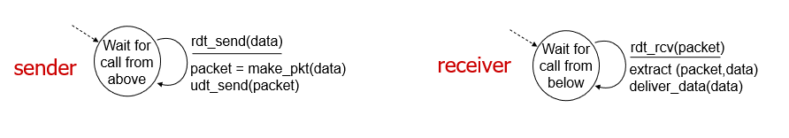
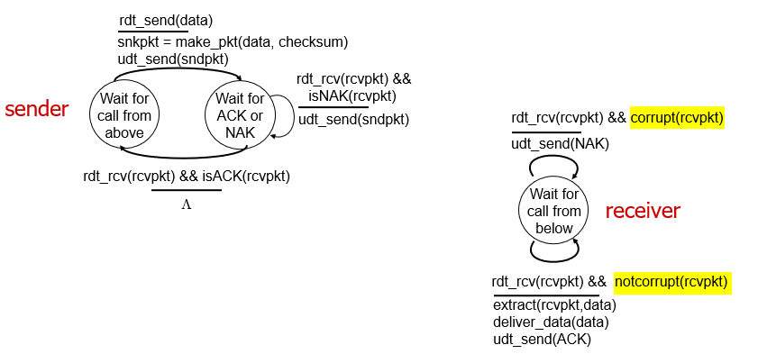
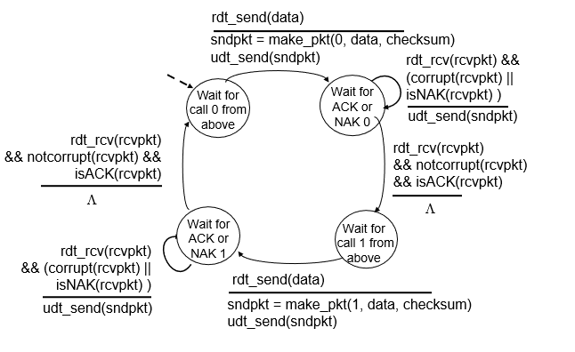
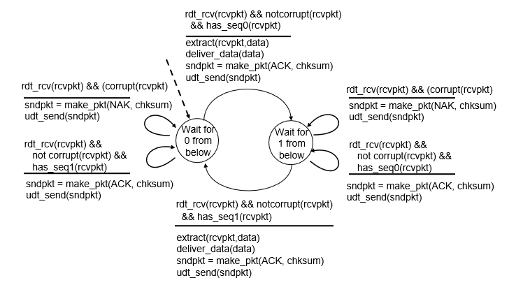
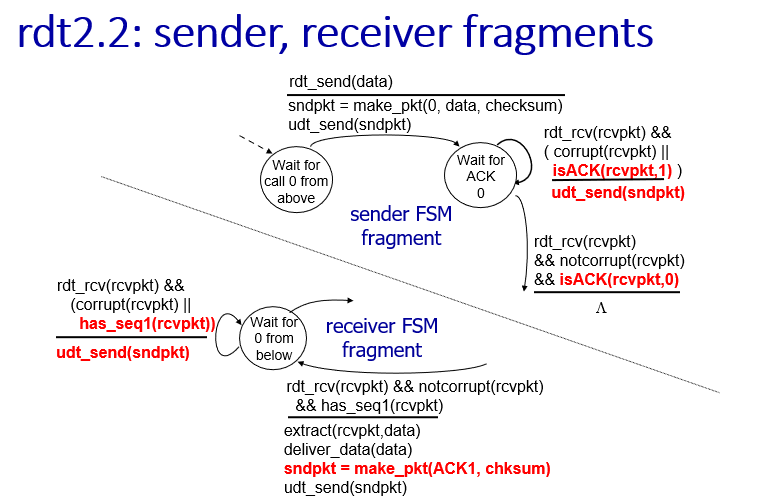
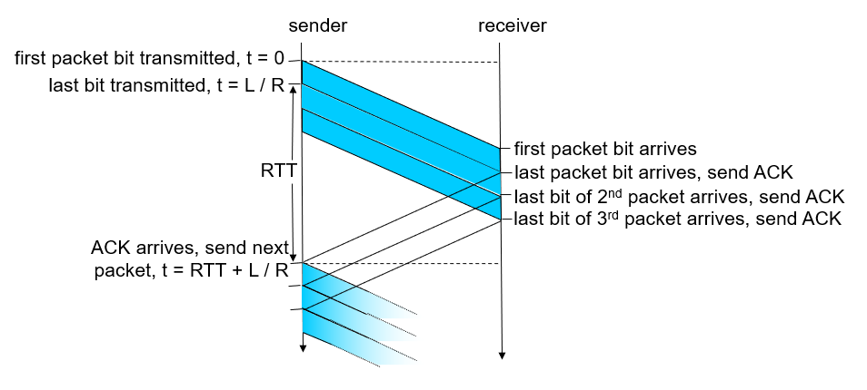
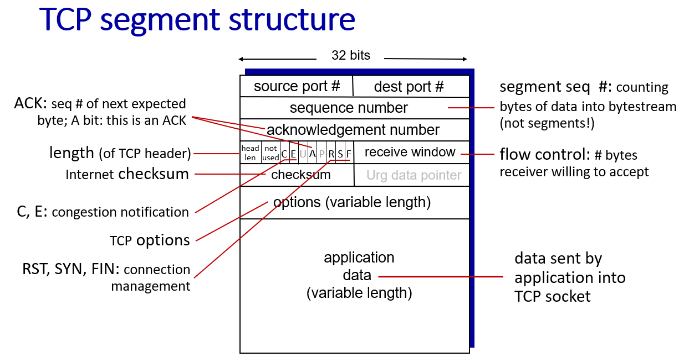

# Chapter 3 - Transport Layer

- [Transport Layer Services](#transport-layer-services)
- [Multiplexing and Demultiplexing](#multiplexing-and-demultiplexing)
- [Connectionless Transport: UDP](#connectionless-transport-udp)
- [Connection-oriented Transport: TCP](#connection-oriented-transport-tcp)
- [Principles of Congestion Control](#principles-of-congestion-control)
- [TCP Congestion Control](#tcp-congestion-control)
- [Evolution of Transport Layer Functionality](#evolution-of-transport-layer-functionality)

## Questions
- How does UDP function when network service is compromised
- What is the point of TCP fast retransmit

## Transport Layer Services
Sender: Breaks application messages into segments, passes to network layer
Receiver: Reassembles segments into messages, passes to application layer

Transport layer: communication between processes (relies on and enhances network layer services)
Network layer: communication between hosts

Two principal internet transport protocols
- TCP: Transmission Control Protocol
    - Reliable, in-order delivery
    - Congestion control
    - Flow control
    - Connection setup
- UDP: User Datagram Protocol
    - Unreliable, unordered delivery
    - No-frills extension of "best-effort" IP
- Services not available:
    - Delay guarantees
    - Bandwidth guarantees

## Multiplexing and Demultiplexing
Multiplexing as sender: handle data from multiple sockets and add transport header
Demultiplexing as receiver: Use header info to deliver received segments to correct socket

**How Demultiplexing Works**
- Host receives IP datagrams
    - Each datagram has source IP address & destination IP address
    - Each datagram carries one transport-layer segment
    - Each segment has source & destination port number
- Host uses IP addresses & port numbers to direct segment to appropriate socket

**Connectionless Demultiplexing**
- When creatign datagram to send into UDP socket, must specify: Destination IP address and port number
- When receiving host recieves UDP segment
    1. Check destination port # in segment
    2. Directs UDP segment to socket with that port #
- IP/UDP datagrams with same destination port but different source IP addresses and/or source port numbers will be directed to the same socket at the receiving host

**Connection-oriented Demultiplexing**
- TCP socket identified by 4-tuple
    - Source IP address
    - Source port number
    - Destination IP address
    - Destination port number
- Demux: receiver uses all four values (4-tuple) to direct segment to appropriate socket
- Server many support as many simultaneous TCP sockets
    - Each socket identified by its own 4-tuple
    - Each socket associated with a different connecting client
- Ex. Three segments with different source ports going to the same dest port will all be demultiplexed into different sockets

**In summary**
- UDP: Demultiplexing using destination port only
- TCP: Demultuplexing using 4-tuple: source IP, destination IP, and port numbers

## Connectionless Transport: UDP
- "No frills", "bare bones" internet transport protocol
- "Best effort" service: segments could be lost or delivered out of order
- Connectionless as in there's no handshaking between sender and receiver
    - Also each UDP segment is handled independently of others

- **Why is there a UDP?**
    - No connection establishment (can add RTT delay thus faster)
    - Simple: no connection state at sender and receiver
    - Small header size
    - No congestion control
        - Can blast away as fast as wanted (lol?)
        - Can function in face of congestion
- UDP is used in: 
    - Streaming, DNS, SNMP, HTTP/3
    - If reliable transfer needed over UDP (ex. HTTP/3) add it in application layer along with congestion control

**Internet Checksum**
Goal: detect errors (i.e. flipped bits) in transmitted segment
- Sender:
    - Treat contents of UDP segment (including UDP header fields and IP addresses) as sequence of 16-bit integers
    - Checksum: addition of segment content
    - Checksum value put into UDP checksum field
- Receiver:
    - Compute checksum of received segment
    - Check if computed checksum equals checksum field value
        - Not equal: error detected
        - Equal: no errors detected (for now)

**Summary**
- "No frills" protocol
    - Segments may be lost, delivered out of order
    - Best effor service: "send and hope for the best"
- Plusses:
    - No setup/handshaking needed
    - Can function when network service is compromised
    - Helps with reliability (checksum)
- Can build additional functionality on top of UDP in application layer

## Principles of Reliable Data Transfer
- Complexity of reliable data transfer protocol will depend on characteristics of unreliable channel (lose, corrupt, reorder data)
- Sender & receiver don't know the "state" of each other (what a message received) unless communicated via a message 

- `rdt` = Reliable data transfer
Function interfaces:
- `rdt_send()`: called from above (by app). Passed data to deliver to receiver upper layer (data)
- `udt_send()`: called by `rdt` to transfer packet over unreliable channel to receiver (packet)
- `rdt_rcv()`: called when packet arrives on receiver side of channel (packet)
- `deliver_data()`: called by `rdt` to deliver data to upper layer (data)

**rdt1.0**: Reliable transfer over a reliable channel
- Underlying channel perfectly reliable: no bit errors or loss of packets
- Separate FSMs for sender & receiver
    - Sender sends data into underlying channel
    - Receiver reads data from underlying channel

Note: Above line is the event, below the line is the action taken

**rdt2.0**: Channel with bit errors
- Underlying channel may flip bits in packet
    - Use checksum to detect bit errors
- How do you recover from the errors though?
    - Acknowledgements (ACKs): Receiver explicitly tells sender that pkt received OK
    - Negative acknowledgements (NAKs): Receiver explicitly tells sender that pkt had errors
    - Sender retransmits pkt on receipt of NAK

- **Stop and Wait**: Sender sends one packet, then waits for response

Note: "state" of receiver isn't known to sender unless that it somehow communicated from receiver to sender
- What happens if ACK/NAK is corrupted?
    - Sender doesn't know what happened at receiver
    - Can't just retransmit: possible duplicate
- Handling duplicates
    - Sender retransmits current pkt if ACK/NAK corrupted
    - Sender adds sequence number to each pkt
    - Receiver discards (doesn't deliver up) duplicate packet

rdt 2.1: Sender & handling garbled ACK/NAKs

rdt 2.1: Receiver & handling garbled ACK/NAKs

Sender:
- Sequence # added to packet
- Two sequence numbers (0, 1) will suffice
- Must check if received ACK/NAK corrupted
- Twice as many states: State must "remember" whether "expected" packet should have sequence number of 0 or 1

Receiver:
- Must check if received packet is duplicate
    - State indicates whether 0 or 1 is expected packet sequence #
- Receiver can not know if its last ACK/NAK received OK at sender

**rdt2.2**: A NAK-free protocol
- Same functionality as rdt2.1 using ACKs only
- Instead of NAK, receiver sends ACK for last packet received OK
    - Receiver must explicitly include sequence number of packet being ACKed
- Duplicate ACK at sender results in same action as NAK: *retransmit current packet*

**rdt3.0**: Channels with errors and loss
- New channel assumption: underlying channel can also lose packets (data, ACKs)
    - Checksum, sequence numbers, ACKs, retransmissions will be of help but not enough!
- Approach: sender waits "reasonable" amount of time for ACK
    - Retransmit if no ACK received in this time
    - If packet (or ACK) just delayed (not lost):
        - Retransmission will be duplicate but sequence numbers already handles this
        - Receiver must specify sequence number of packet being ACKed
    - Use countdown timer to interrupt after "reasonable" amount of time

Theres a couple of different cases, each of which are ok:
- No loss, packet loss, ACK loss, premature timeout/delayed ACK

- Utilization: Fraction of time sender busy sending
    - d(trans) / (RTT + d(trans))
    - Protocol limits performance underlying infrastructure

- Pipelining: sender allows multiple "in flight" yet-to-be-acknowledged packets
    - Range of sequence numbers must be increased
    - Buffering at sender and/or receiver

With pipelining all it does is just send multiple packets within a window without necessairly being ACKed

Other Strategies
---
**Go-Back-N Sender**
- Sender "window" of up to N, consecutive transmitted but unACKed packets
    - Only shift the window once lowest requested packet comes back with an ACK
- Cumulative ACK: ACK(n): ACKs all packets up to, including sequence number n
    - On receiving ACK(n): move window forward to begin at n+1
- Timer for oldest in-flight packet
- Timeout(n): retransmit packet n and all higher sequence number packets in the window

**Go-Back-N Receiver**
- ACK-only: always send ACK for correctly-received packet so far with highest in-order sequence number
    - May generate duplicate ACKs
    - Need only remember `rcv_base`
- On receipt of out-of-order packet:
    - Can discard (don't buffer) or buffer: an implementation decision
    - Re-ACK packet with highest in-order sequence number

**Selective Repeat**
- Pipelining: multiple packets in flight
- Receiver individually ACKs all correctly received packets
    - Buffers packets, as needed, for in-order delivery to upper layer
- Sender:
    - Maintains (conceptually) a timer for each unACKed packet
        - Timeout: retransmits signle unACKED packet associated with timeout
    - Maintains (conceptually) a "window" over N consecutive sequence numbers
        - Limits pipelined "in flight" packets to be within this window

**Sender**
- Data from above: if next available sequence number in window, send packet
- Timeout(n): resend packet n, restart timer
- ACK(n) in [sendbase, sendbase+N-1]:
    - Mark packet n as received
    - If n smallest unACKed packet, advance window base to next unACKed sequence number

**Receiver**
- Packet n in [rcvbase, rcvbase+N-1]:
    - Send ACK(n)
    - Out-of-order: buffer
    - In-order: deliver (also deliver buffered, in-order packets) advance window to next non-yet-received packet
- Packet n in [recvbase-N, rcvbase-1]: ACK(n)
- Otherwise: ignore

MAKE SURE UNDERSTAND THESE!!

## Connection-oriented Transport: TCP
- Point to point: one sender, one receiver
- Reliable, in-order byte stream: no "message boundaries"
- Full duplex data: bi-directional data flow in same connection with MSS being the max segment size
- Cumulative ACKs
- Pipelining: TCP congestion and flow control set window size
- Connection-oriented: handshaking initializes sender & receiver state before data exchange
- Flow controlled: sender will not overwhelm receiver

- SYN (synchronize): initiates new conneciton
- FIN (finish): end of data transmission for "graceful connection closure"
- RST (reset): abruptly terminates the connection if sender feels like something is wrong

Sequence Numbers: Byte stream "number" of first byte in segment's data
Acknowledgements: Sequence number of next byte expected from other side (cumulative ACK)
- Cumulative ACK: When a receiver successfully receives a packet, it sends an ACK back to the sender, but instead of acknowledging just that single packet, it acknowledges all packets received up to and including the sequence number of that packet.

**RTT and Timeout:**
How to set TCP Timeout Value
- Longer than RTT
- Too short: premature timeout unnecrssary retransmissions
- Too long: slow reaction to segment loss

How to estimate RTT:
- SampleRTT: measured time from segment transmission until ACK receipt (ignore retransmissions)
- SampleRTT will vary, want estimated RTT "smoother"
    - Average several recent measurements not just current SampleRTT

`EstimatedRTT = (1-a)*EstimatedRTT + a*SampleRTT`
- Exponential Weighted Moving Average (EWMA)
- Influence of past sample decreases exponentially fast
- Typeical value: a = 0.125

Timeout interval: EstimatedRTT + "safety margin"
`TimeoutInterval = EstimatedRTT + 4*DevRTT`
- `DevRTT = (1-b)*DevRTT + b*|SampleRTT-EstimatedRTT|
- DevRTT = EWMA of SampleRTT deviation from EstimatedRTT
- Large variation in EstimatedRTT means you want a larger "safety margin"

**TCP Sender:**
- Event: data recieved from application
    - Create segment with sequence number
    - Sequence number is byte-stream number of first data byte in segment
    - Start timer if not already running
        - Think as for oldest unACKed segment
        - Expiration interval: TimeOutInterval
- Event: timeout
    - Retransmit segment that caused timeout
    - Restart timer
- Event: ACK received
    - If ACK acknowledges previously unACKed segments update what is known to be ACKed and start timer if there are still unacked segments

**TCP Fast Retransmit**
- If sender receives 3 additional ACKs for same data ("triple duplicate ACKs") resent unACKed segment with smallest sequence number
- Likely that unACKed segment lost so don't wait for timeout

TCP Flow Control
---
What happens if network layer delivers data faster than application layer removes data from socket buffers? ==> Gets overwhelmed

**Flow control**: Receiver controls sender, so sender won't overflow receiver's buffer by transmitting too much too fast
- TCP receiver "advertises" free buffer space in `rwnd` field in TCP header
    - `RcvBuffer`: set size via socket options (typically 4096)
    - Many operating systems auto-adjust `RcvBuffer`
- Sender limits amount of unACKed (in flight) data to received `rwnd`
- Guarantees receive buffer will not overflow

**TCP Connection Management**
- Before exchanging data, sender/receiver "handshake"
    - Agree to establish connection (each knowing the other willing to establish connection)
    - Agree on connection parameters (starting sequence numbers and other stuff)

**Handshaking**
- Sometimes the two-way handshake isn't enough ==> What if the connection terminates when there's data still in transit?
- Three Way Handshake: SYN bit and SlYNACK

**Closing a TCP Connection**
- Client & server each close their side of connection ==> send TCP segment with FIN bit = 1
- Respond to received FIN with ACK ==> on receiving FIN and ACK can be combined with own FIN
- Simultaneous FIN exchanges can be handled

## Principles of Congestion Control
Congestion: "too many sources sending too mach data too fast for the network to handle"
- Long delays (queueing in router buffers)
- Packet loss (buffer overflow at routers)

Congestion control: Too many senders senting too fast
Flow Control: One sender too fast for one receiver
Idealization: Perfect knowledge
- Sender only sends when router buffers available
Idealization: Some perfect knowledge
- Packets can be lost (dropped at router) due to full buffers
- Sender knows when packet has to be dropped and only resends if packet is known to be lost
Realistic Scenario: Unneeded duplicates
- Packets can be lost and ropped at router due to full buffers requiring retransmissions
- Sender can time out prematurely sending two copies, both of which are delivered 

**Costs of Congestion**
- More work (retransmission) for given receiver throughput
- Unneeded retransmissions: link carries multiple copies of a packet
    - Decreasing maximum achievable throughput
- When packet dropped, any upstream transmission capacity and buffering used for that packet was wasted

Insights:
- Throughput can never exceed capacity
- Delay increases as capacity approached
- Loss/retransmission decreases effective throughput
- Unneeded duplicates further decreases effective throughput
- Upstream transmission capacity/buffering wasted for packets lost downstream

Approaches Towards Congestion Control
---
**End-End Congestion Control**
- No explicit feedback from network
- Congestion inferred from observed loss & delay
- Approach taken by TCP

**Network-assisted congestion control**
- Routers provide direct feedback to sending/receiving hosts with flows passing through congested router
- May indicate congestion level or explicitly set sending rate
- TCP ECN, ATM, DECbit protocols

## TCP Congestion Control
**Additive Increase Multiplicate Decrease**
- Senders can increase sending rate until packet loss (congestion) occurs, then decrease sending rate on loss event
- Additive Increase: increase sending rate by 1 maximum segment size every RTT until loss detected
- Multiplicative Decrease: cut sending rate in half at each loss event
    - TCP Reno: Cut in half on loss detected by triple duplicate ACK
    - TCP Tahoe: Cut to 1 MSS (max segment size) when loss detected by timeout
- Sawtooth behavior: probing for bandwidth

**Slow Start**
- When connection begins increase rate exponentially until first loss event
    - Initially `cwnd` = 1 MSS
    - Double `cwnd` every RTT
    - Done by incrementing `cwnd` for every ACK received
- Initial rate is slow but ramps up exponentially fast
    - Variable `ssthresh` is set to 1/2 of `cwnd` just before loss event

**TCP Cubic**:
- Better way than AIMD to "probe" for usable bandwidth
- W(max) = sending rate at which congestion loss was detected
- Congestion state of bottleneck link probably hasn't changed much
    - After cutting rate/window in half on loss, initially ramp to W(max) faster but then approach W(max) more slowly
- K: point in time when TCP window size will reach W(max)
- Increase W as a function of the cube of the distance between current time and K
    - Larger increases when further away from K
    - Smaller increases when nearer K
- Default option and most popular TCP for popular web servers

- Increasing TCP's sending rate until packet loss occurs at some router's output: the bottleneck link
- Increasing TCP sending rate will not increase end-end throughout with congested bottleneck
- Increasing TCP sending rate will increase measured RTT

**Delay-based TCP Congestion Control**
- Keeping sender-to-receiver pipe "just full enough but no fuller"
    - Keep bottleneck link busy transmitting but avoid high delays/buffering
- RTT(min) - minimum observed RTT
- Uncongested throughput with congestion window `cwnd` is cwnd/RTT(min)
    - If measured throughput "very close" to uncongested throughput increase `cwnd` linearly
    - If measured throughput "far below" uncongested throughout decrease `cwnd` linearly
- `Measured throughput = # bytes sent in last RTT interval / RTT(measured)

- Congestion control wihtout inducing/forcing loss
- Maximizing throughout (keeping pipe full) while keeping delay low (but not fuller)
- A number of deployed TCPs take a delay-based approach (Google's backbone network)

Explicit Congestion Notification (ECN)
- TCP deployments often implement network-assisted congestion control
    - Two bits in IP header (ToS field) marked by network router to indicate congestion
        - Policy to determine marking chosen by network operator
    - Congestion indication carried to destination
    - Destination sets ECE bit on ACK segment to notify sender of congestion
    - Involves both IP (IP header ECN bit marking) and TCP (TCP header C,E bit marking)

**TCP fairness**
- Gairness goal: if K TCP sessions share same bottleneck link of bandwith R, each should have averate rate of R/K
- TCP is fair under idealized assumptions (same RTT, fixed number of sessions only in congestion avoidance)

**Fairness: must all be fair**
- Fairness and UDP
    - Multimedia apps often do not use TCP (do not want rate throttled by congestion control)
    - Instead use UDP (Send audio/video at constant rate, tolerate packet loss)
    - There is no "internet police" policing use of congestion control
- Fairness parallel TCP connections
    - Application can open multiple parallel connections between two hosts
    - Web browsers do this (link of rate R with 9 existing connections)

## Evolution of Transport Layer Functionality
QUIC: Quick UDP internet Connections
- Application layer protocol on top of UDP
    - Increase performance of HTTP
    - Deployed on many Google servers & apps
- Has error and congestion control as well as connection establishment

- Only requires one handshake (QUIC) vs two for TCP (TCP for transport layer and TLS (security) for application layer)
