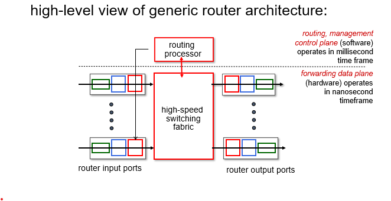

# Chapter 4 - Network Layer

- [Network Layer: Data Plane](#network-layer-data-plane)
- [What's inside a router](#whats-inside-a-router)
- [IP - Internet Protocol](#ip-internet-protocol)

## Questions
- Can we go over the pros/cons of the different aspects of a router (in class quiz)

## Network Layer - Data Plane
- Routers
    - Examines header fields in all IP datagrams passing through it
    - Moves datagrams from input ports to output ports to transfer datagrams along end-end path

- Basic functions:
    - Forwarding: move packets from a router's input link to appropriate router output link
        - Getting through single interchange
    - Routing: determine route taken by packets from source to destination
        - Planning from start to finish

- Data Plane:
    - Local, per-router function
    - Determines how datagram arriving on router input port is forwarded to router output port
- Control Plane
    - Network-wide logic
    - Determines how datagram is routed among routers along end-end path from source host to dest host
    - Two control-plane approaches
        - Traditional routing algorithms (implemented in routers)
        - Sofrware-defined networking (SDN) (implemented in remote servers)

- Service model:
    - "best effort" as in no guarantees on:
        - Successful datagram delivery to destination
        - Timing or order of delivery
        - Bandwidth available to end-end flow
    - Allowed internet to be widely deployed and adpoted
    - Allows performance of real-time applications
    - Allow services to be provided from multiple locations
    - Congestion control of "elastic" services helps

## What's Inside a Router

- Input ports
    - Physical layer: bit-level reception
    - Link layer: Ethernet/wireless
    - Decentralized switching
        - Use header field values, lookup output port using forwarding table in input port memory
        - Goal: complete input port processing at 'line speed'
        - Input port queuing: if datagrams arrive faster than forwarding rate into switch fabric
    - Forwarding options:
        - **Destination-based forwarding**: forward based only on destination IP address
        - **Generalized forwarding**: Forward based on any set of header field values

**Longest prefix matching**: when looking for forwarding table entry for given destination address, use longest address prefix that matches destination address

- Switching fabrics
    - Transfer packet from input link to appropriate output link
    - Switching rate: rate at which packets can transfer from inputs to outputs
        - Often measured as a multiple of input/output line rate
        - N inputs: switching rate N times line rate desireable
    - Three major types: memory, bus, interconnection network

    - Switching via memory:
        - Used under direct control of CPU
        - Packet copied into system memory
        - Speed limited by memory bandwidth (2 bus crossings per datagram)
    - Switching via bus:
        - Datagram from input port memory to ouput port memory via a shared bus
        - Bus contention: switching speed limited by bus bandwidth
    - Switching via interconnection network:
        - nxn switch from multiple stages of smaller switches
        - Initially developed to connect processors in multi-processors
        - Can be parallelized (can use multiple switching "planes" in parallel)

- Input port queuing
    - If switch fabric speed < input ports combined 
    - Head of line (HOL) blocking could exist like before!
- Output port queuing
    - Buffering arrival rate via switch exceeds output line speed
    - Queueing (delay) and loss due to output port buffer overflow
    - Buffering required when datagrams arrive from fabric faster than link transmission rate
        - Datagrams can be lost due to congestion, lack of buffers
    - Scheduling discipline chooses among queued datagrams for transmission
        - Priority scheduling: who gets best performance (net neutrality)

    - Average buffering equal to "typical" RTT
    - More recent: with N flows, buffering = RTT * C / sqrt(N)
    - Too much buffering can increase delays

- Buffer management: 
    - Drop: which packet to add, drop when buffers are full (tail = drop arriving, priority = drop based on priority basis)
    - Marking: which packets to mark to signal congestion
- Packet scheduling:
    - Deciding on which packet to send next on link (first come-first serve, priority, round robin, weighted fair queueing)
    - First come first serve: packets transmitted in order of arrival to output port
    - Priority scheduling:
        - Arriving traffic classified, queued by class (classify by header field)
        - Send packet from highest priority queue that has buffered packets (FCFS within priority class)
    - Round Robin scheduling:
        - Arriving traffic classified, queued by class (classify be header field)
        - Server cyclically, repeatedly scans class queues, sending one complete packet from each class (if available) in turn
    - Weighted fair queuing:
        - Generalized round robin
        - Each class, i, has a weight w(i) and gets weighted amount of service in each cycle w(i) / sum(w(j))
        - Minimum bandwidth guarantee

## IP - Internet Protocol
- IP address = 32-bit identifier associated with each host or router interface
- Intercae = connection between host/router and physical link
    - Routers typically have multiple interfaces
    - Host typically has one or two interfaces (ex. ethernet and wifi)

- Subnet = device interface that can physically reach each other without passing through an intervening router
    - To define a subnet, detach each interface from its host or router creating "islands" of isolated networks
    - Each isolated network is called a subnet
- IP address strucutre:
    - Subnet part: devices in same subnet have common high order bits
    - Host part: remaining low order bits

- CIDR: Class InterDomain Routing
    - Subnet portion of address of arbitrary length
    - a.b.c.d/x where x is # of bits in subnet portion of address

- How does host get IP address
    - Hard-coded by sysadmin in config file (ex. in UNIX in /etc/rc.config)
    - **DHCP**

- DHCP (Dynamic Host Configuration Protocol)
    - Dynamically get address from server
    - "plug-and-play"
    - Host dynamically obtains IP address from network server when it "joins" network
        - Can renew its lease on address in use
        - Allows reuse of addresses (only hold address while connected/on)
        - Support for mobile users who join/leave
    - Overview:
        - Host broadcasts DHCP discover message
        - DHCP server responds with DHCP offer message
        - Host requests IP address: DHCP request message
        - DHCP server sends address: DHCP ACK message
    - Can return more than just allocated IP address on subnet
        - Address of first-hop router for client
        - Name and IP address of DNS server
        - Network mask (indicating network vs. host portion of address)

Q: How does network get subnet part of IP address
A: Gets allocated portion of its provider ISP's address space

- Hierarchial addressing: allows efficient advertisement of routing information

Q: How does an ISP get block of addresses?
A: ICANN (Internet Corporation for Assigned Names and Numbers)
    - ALlocates IP addresses through 5 regional regrestries (who may then allocate to local registries)
    - Manages DNS root zone including delecation of TLD (top level domain) management
- ICANN allocated last chunk of IPv4 addresses to RRs in 2011 (32-bit)
- IPv6 has 128-bit address space

- NAT: Network Address Translation
    - All devices in local network share ONE IPv4 address as far as outside world is concerned
    - AKA all datagrams leaving local network have same source NAT IP address but different source port numbers
    - All devices in local network have 32-bit addresses in a "private" IP address space (10/8, 172.16/12, 192.168/16 prefixes) that can only be used in local network
    - Advantages:
        - Just one IP address needed from provider ISP for all devices
        - Can change addresses of host in local network without nitifying outside world
        - Can change ISP without changing addresses of devies in local network
        - Security: Devices inside local net not directly addressable or visible by outside world
    - Implementation
        - Outgoing datagrams: replace (source IP, port) of every outgoing datagram to (NAT IP, new port)
        - Remember in NAT translation table: evert (source IP, port) to (NAT IP, new port) translation pair
        - Incoming datagrams: replace (NAT IP, new port) in dest fields of every incoming datagram with corresponding (source IP, port) stored in NAT table
    - Is controversal
        - Address "shortage" should be solved by IPv6
        - Violates end-end argument (port # manipulation)
    - Here to stay as it's used extensively

- IPv6
    - Initial motivation: 32-bit IPv4 address space would be completely allocated
    - 40-byte fixed length header
    - Enables different network-layer treatment of "flows"

    - Not all routers can be upgraded simultaneously
    - Tunneling: IPv6 datagram carried as payload in IPv4 datagram among IPv4 routers (packet within packet kinda)
    - Google: 40% of clients access services via IPv6

- Generalized forwarding: match plus action
    - Destination-based forwarding: forward based on destination IP address
    - Generalized forwarding: 
        - Many header fields can determine action
        - Many action possible: drop/copy/modify/log packet

- Flow table abstraction
    - Flow: defined by header fields
    - Generalized forwarding: simple packet-handling rules
        - Match: pattern values in packet header fields
        - Actions: for matched packet: drop, forward, modify, matched packet or send matched packet to controller
        - Priority: disambiguate overlapping patterns
        - Counters: # bytes and # packets

- OpenFlow abstraction
    - Match + action: abstraction unifies different kinds of devices
    - Router: 
        - Match: Longest destination IP prefix
        - Action: forward out a link
    - Switch:
        - Match: destination MAC address
        - Action: forward or flood
    - Firewall
        - Match: IP addresses and TCP/UDP port numbers
        - Action: permit or deny
    - NAT
        - Match: IP address and port
        - Action: rewrite address and port

