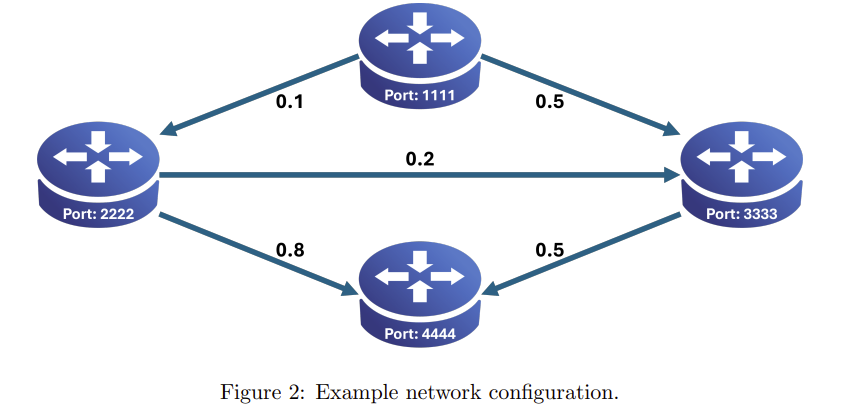

# Go Back N Protocol

Go-Back-N Protocol over UDP implemented in python. Completed under supervision of Professor Levin during the Spring 2025 Semester at The Cooper Union.

## Program Usage

```console
python3 networknode.py <local-port> receive <neighbor1-port> <loss-rate-1> ... <neighbor-M-port> <loss-rate-M> send <neighbor(M+1)-port> ... <neighbor(N)-port> [last]
```
### Syntax:
- `<local-port>`: UDP listening port number of the node
- `receive`: Current node will be the **probe receiver** from the following neighbors.
- `<neighbor#-port>`: UDP listening port number of one of the neighboring nodes
- `<loss-rate-#>` Probability to drop the probe backets from this neighbor
    - Loss rate # is directly tied to the neighbor port #
- `send`: Current node will be the **probe sender** to the following neighbors
- `last`: Indication of the last node being loaded to the network. With this input, the network is considered complete and all nodes will begin exchanging packets.
- `ctrl+C`: Used to exit program

### Example usage:


The network above will be applied to four different terminal instances with the following strucutre:
```console
Terminal 1: $ python3 networknode.py 1111 receive send 2222 3333 (receiving list is empty)
Terminal 2: $ python3 networknode.py 2222 receive 1111 .1 send 3333 4444
Terminal 3: $ python3 networknode.py 3333 receive 1111 .5 2222 .2 send 4444
Terminal 4: $ python3 networknode.py 4444 receive 2222 .8 3333 .5 send last (sending list is empty)
```
- Credit to Professor Levin for the syntax and example usage

